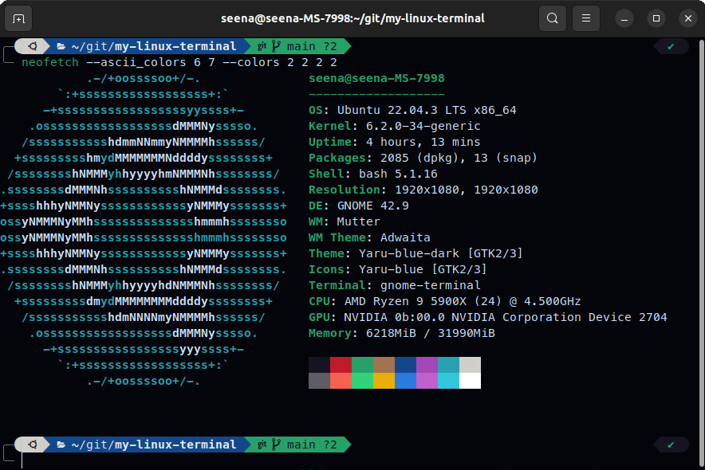

# Terminal Profile



# Prerequisites

```bash
# Update your software repositories.
sudo apt-get update
sudo apt-get upgrade

# Install Git.
sudo apt-get install -y git

# Install Vim.
sudo apt-get install -y vim
```

# Installation

```bash
# Install Zsh.
sudo apt install zsh

# Install Gnome Tweaks.
sudo apt install gnome-tweaks

# Install Oh My Zsh.
sh -c "$(curl -fsSL https://raw.githubusercontent.com/ohmyzsh/ohmyzsh/master/tools/install.sh)"

# Install Powerlevel10k theme.
git clone --depth=1 https://github.com/romkatv/powerlevel10k.git ${ZSH_CUSTOM:-$HOME/.oh-my-zsh/custom}/themes/powerlevel10k

# Install zsh-syntax-highlighting.
git clone https://github.com/zsh-users/zsh-syntax-highlighting.git ~/.oh-my-zsh/custom/plugins/zsh-syntax-highlighting

# Install zsh-autosuggestions.
git clone https://github.com/zsh-users/zsh-autosuggestions ~/.oh-my-zsh/custom/plugins/zsh-autosuggestions
```

# Configuration

Restart your terminal. You should be prompted to set up the Powerlevel10k configuration. If not, run:

```
p10k configure
```

After installing paste all `.tff` files from `/fonts` into `home/{user}/.fonts`

```
cp /fonts/*.ttf ~/.fonts/
```

Open your Zsh configuration file:

```
vim .zshrc
```

In your ~/.zshrc file, update the following lines:

```
ZSH_THEME="powerlevel10k/powerlevel10k"
plugins=(git zsh-autosuggestions zsh-syntax-highlighting web-search)
```

Activate Fonts by Opening `tweaks` and change Monospace Text to MesloLGS NF Regular (Size 11)

You may now restart the terminal and go into preferences to modify any existing colors you would like to edit.

# Notes

How to display terminal information (I use Neofetch).

```
sudo apt-get install neofetch

# Display the profile
# I override the colors because the default red is kinda ugly in this theme.
neofetch --ascii_colors 6 7 --colors 2 2 2 2
```

## Anaconda

```
source /anaconda3/bin/activate
conda init zsh
```

## Reset the changes back to the old terminal.

There's two main modifications being done to the terminal. The terminal theme, and the shell itself.

For the theme, here's a thread I found on the internet on how to reset it to the default: https://askubuntu.com/questions/14487/how-to-reset-the-terminal-properties-and-preferences

For the terminal shell itself, we actually installed a new terminal (zsh) alongside the default bash. Bash itself wasn't removed, but we just set the default shell to `zsh`. Here is a thread on how to uninstall zsh and default back to bash: https://askubuntu.com/questions/958120/remove-zsh-from-ubuntu-16-04
